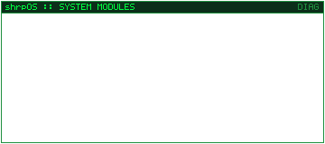
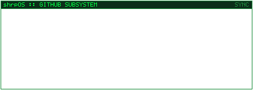

<p align="center"><strong>shrpOS</strong> — a small, original fictional terminal with a mind of its own.</p>

<div align="center">
<table>
  <tr>
    <td align="center"></td>
    <td align="center"></td>
  </tr>
  <tr>
    <td align="center" colspan="2"></td>
  </tr>
  <tr>
    <td align="center"></td>
    <td align="center"></td>
  </tr>
</table>
</div>

<p align="center">
  <a href="https://mikesstash.com.br">
    
  </a>
</p>

The panels above are animated shrpOS terminal fragments — a few small, slightly odd sessions that type a command, poke around, print a result, blink at you and clear themselves away. The last one is the way out: click it to leave the fictional terminal and open **Mike's Stash**. shrpOS is not pretending to be an operating system; it is a tiny terminal personality that lives on this profile. Everything below is the human-readable layer.

## About

I'm **Marcelo**, a software developer interested in building tools, runtime systems, and strange little projects that sit somewhere between application development and games.

Most of my current work revolves around C# / .NET, game modding, Linux, and experimenting with AI-assisted development workflows. Find me on GitHub at [github.com/MikeMequis1](https://github.com/MikeMequis1).

### Currently exploring

- C# / .NET for desktop tooling and game-adjacent software
- Modding runtimes and detours — Harmony, Mono and FNA
- Linux as both a development environment and a target platform
- AI-assisted development and agent-based workflows

## Asher

**Asher** is a modding platform for *Dust: An Elysian Tail*, focused on making runtime patches and mods easier to develop, distribute and use.

It spans C# / .NET, Harmony, Mono / FNA, and cross-platform experimentation between Windows and Linux, and it is still in active development.

The repository and documentation links will be published here once the project is public. Until then, public repositories are listed at [github.com/MikeMequis1?tab=repositories](https://github.com/MikeMequis1?tab=repositories).

## Things I like building

- Developer tooling
- Modding infrastructure
- Runtime experiments
- Cross-platform desktop software
- Small tools that make complicated workflows a little less annoying

## Technology

Tools currently used, explored or relevant to active projects. The badges are the complete list; the stack monitor above verifies only the modules Asher is built on. No proficiency scores.

<p>
  
  
  
  
  
  
  
  
  
  
</p>

## Links

- GitHub profile — [github.com/MikeMequis1](https://github.com/MikeMequis1)
- Repositories — [github.com/MikeMequis1?tab=repositories](https://github.com/MikeMequis1?tab=repositories)
- Issues / contact — [github.com/MikeMequis1/MikeMequis1/issues](https://github.com/MikeMequis1/MikeMequis1/issues)

## GitHub activity

<p align="center">
  
  
  
  
  
</p>

<p align="center">
  
</p>

Live counters come from the GitHub public API and may lag behind the profile. If a feed is unavailable, the authoritative numbers — including the primary language breakdown — remain visible at [github.com/MikeMequis1](https://github.com/MikeMequis1).

## Maintenance

The monitor GIFs in `assets/monitors/` are generated locally and committed, so viewing the profile needs no build step:

```text
node scripts/generate-monitors.mjs
```

Each monitor is a terminal timeline — type a command, process it, print a result, hold, clear and reset — defined in `scripts/generate-monitors.mjs`. The reusable terminal primitives and the GIF89a/LZW encoder live in `scripts/monitor.mjs`, and the local 5x7 bitmap font lives in `scripts/monitor-font.mjs`. Output is deterministic: re-running the command produces byte-identical GIFs. Architecture notes: [`docs/shrpos-monitors.md`](docs/shrpos-monitors.md).
