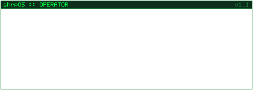
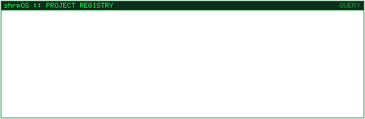
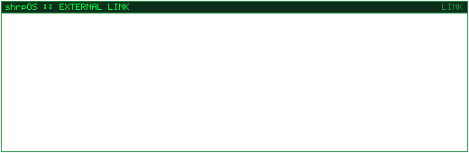

  
  

  
  

## About

I'm **Marcelo**, a software developer focused on **C#/.NET**, with an interest in building tools, runtime systems, and cross-platform software.

I particularly enjoy projects that sit somewhere between **application development, game technology, and infrastructure** — especially when they involve understanding how existing systems work and finding practical ways to extend or improve them.

### Currently exploring

- C# / .NET for application and developer tooling
- Modding runtimes, patching, and detours — Harmony, Mono, and FNA
- Cross-platform development for Windows and Linux
- Software architecture and maintainable project structure
- AI-assisted development and agent-based engineering workflows

### Things I like building

- Developer tooling
- Modding infrastructure
- Runtime and framework experiments
- Cross-platform desktop software
- Tools that simplify complicated workflows
- Small projects that turn curiosity into something useful

## Featured project

### Asher

**Asher** is a cross-platform modding platform for *Dust: An Elysian Tail*, focused on providing a structured runtime and tooling for game modifications on Windows and Linux.

The project combines several areas I enjoy working with: **C#/.NET, runtime patching, reverse engineering, cross-platform development, game technology, and developer tooling**.

→ [View Asher on GitHub](https://github.com/MikeMequis1/Asher)

## Tech stack

  
  
  
  
  
  
  
  
  

## GitHub activity

  
  
  
  
  

  

