<p align="center">
  
</p>

<p align="center"><sub><code>sharpOS</code> is an original fictional terminal interface. The human behind it builds software.</sub></p>

<p align="center">
  
</p>

```text
╔════════════════════════════════════════════════════════════╗
║ sharpOS :: PERSONAL DEVELOPMENT TERMINAL                   ║
╠════════════════════════════════════════════════════════════╣
║ USER: MARCELO                              STATUS: ON-LINE ║
║ NODE: github.com/MikeMequis1             SHELL: /bin/sharp ║
║ ROLE: SOFTWARE DEVELOPER                     BUILD: STABLE ║
╚════════════════════════════════════════════════════════════╝
```

<details>
<summary>▶ VIEW RAW BOOT LOG</summary>

```text
sharpOS BIOS v1.0  ::  power-on self-test

> Initializing kernel .................. OK
> Loading user profile ................. OK
> Loading development database ......... OK
> Connecting to GitHub ................. OK
> Loading project registry ............. OK

SYSTEM READY_
WELCOME, MARCELO.
```

</details>

<details>
<summary>▶ ABOUT USER</summary>

```text
ALIAS ....... Marcelo
NODE ........ github.com/MikeMequis1
ROLE ........ software developer
MODE ........ build · break · learn · repeat
```

</details>

<details>
<summary>▶ CURRENTLY EXPLORING</summary>

- C# / .NET for desktop tooling and game-adjacent software
- Modding runtimes and detours — Harmony, Mono, FNA
- Linux as a first-class development and target platform
- AI / LLM assisted development workflows

</details>

<details>
<summary>▶ PROJECT DATABASE</summary>

```text
┌────────────────────────────────────────────────────────┐
│ ─ PROJECT DATABASE ─────────────────────────────────── │
│                                                        │
│ [01] ASHER                                             │
│                                                        │
│      Dust: An Elysian Tail modding platform            │
│                                                        │
│      STATUS  :  ACTIVE DEVELOPMENT                     │
│      REPO    :  [ pending publication ]                │
│                                                        │
│      MODULES :  C# · .NET · HARMONY · MONO             │
│                 FNA · LINUX · WINDOWS                  │
│                                                        │
└────────────────────────────────────────────────────────┘
```

`Asher` is a modding platform for *Dust: An Elysian Tail*. Repository and documentation links will be published here once available. Additional entries will be appended as `[02]`, `[03]`, … as they become public.

</details>

<details>
<summary>▶ TECHNOLOGY MODULES</summary>

Tools currently used, explored, or relevant to active projects. No proficiency scores.

<p>
  
  
  
  
  
  
  
  
  
  
</p>

</details>

<details>
<summary>▶ GITHUB SUBSYSTEM</summary>

```text
┌─ GITHUB SUBSYSTEM ─────────────────────────────────────┐
│ MODE    ......  LIVE                                   │
│ SOURCE  ......  github public api + shields.io         │
│ CACHE   ......  AUTO                                   │
└────────────────────────────────────────────────────────┘
```

<p align="center">
  
  
  
  
  
</p>

<p align="center">
  
</p>

Live counters are pulled from the GitHub public API and may lag behind the profile. If a feed is unavailable, the authoritative numbers — including the primary language breakdown — remain visible at [github.com/MikeMequis1](https://github.com/MikeMequis1).

</details>

<details>
<summary>▶ EXTERNAL LINKS</summary>

| MODULE | ENDPOINT | STATUS |
| :-- | :-- | :-- |
| GITHUB | [github.com/MikeMequis1](https://github.com/MikeMequis1) | ONLINE |
| LINKEDIN | pending configuration | OFFLINE |
| ASHER REPO | pending publication | PENDING |
| ASHER DOCS | pending publication | PENDING |
| CONTACT | pending configuration | PENDING |

</details>

<p align="center">
  
</p>

<details>
<summary>▶ SYSTEM MAINTENANCE</summary>

The three terminal panels in `assets/` are generated, not hand-drawn:

```text
node scripts/generate-profile.mjs
```

Edit the colour tokens and templates in `scripts/generate-profile.mjs`, then re-run it. Generated SVGs are committed, so viewing the profile requires no build step. The README itself is plain GitHub Flavored Markdown — no JavaScript, no injected CSS.

</details>

<!--
  sharpOS :: profile v1.0
  Regenerate assets with: node scripts/generate-profile.mjs
  sharpOS is an original fictional interface; no copyrighted branding is used.
-->
